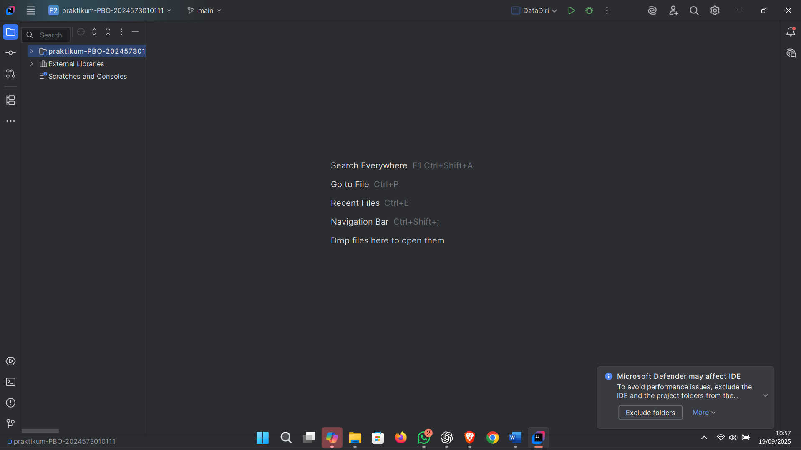
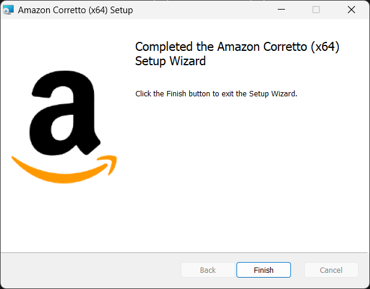
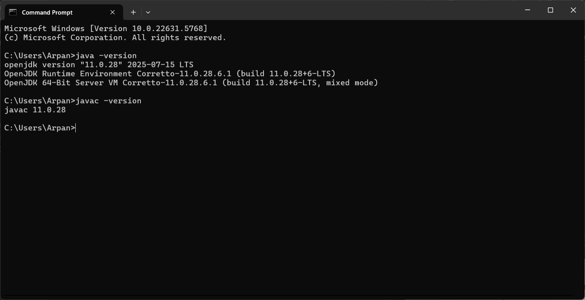

# Laporan Modul 1: Course Introduction & Lab Setup
**Mata Kuliah:** Praktikum Pemrograman Berorientasi Objek   
**Nama:** [Mizaul Arfan]  
**NIM:** [2024573010111]  
**Kelas:** [TI 2A]

---

## 1. Abstrak
Laporan ini menyajikan hasil praktikum modul pertama yang berjudul 
Course Introduction & Lab Setup. Praktikum mencakup teori dasar mengenai paradigma Pemrograman Berorientasi Objek (OOP), Java (JDK, JRE, JVM), serta penggunaan IDE dan pengaturan lingkungan pengembangan (environment) yang diperlukan. Tujuan praktikum ini adalah agar mahasiswa memahami konsep dasar OOP, memahami peran Java sebagai bahasa pemrograman, serta melakukan setup perangkat lunak seperti instalasi JDK, IDE, dan konfigurasi awal untuk proyek Java
---
## 2. Praktikum
### Praktikum 1 - Perkenalan Java dan Ekosistemnya
#### Dasar Teori
>JDK (Java Development Kit): kumpulan tools yang digunakan untuk mengembangkan aplikasi Java, termasuk compiler, libraries, debugger, dan sebagainya.

>JRE (Java Runtime Environment): lingkungan yang diperlukan untuk menjalankan program Java yang telah dikompilasi.

>JVM (Java Virtual Machine): mesin virtual yang menjalankan bytecode Java, menangani memori, dan menjalankan program lintas platform.
#### Langkah Praktikum
1. Download installer Amazon Corretto (versi yang direkomendasikan: Corretto 17 atau Corretto 21) dari situs resmi AWS.

2. Pilih versi yang sesuai untuk sistem operasi (Windows, macOS, atau Linux) dan arsitektur (64-bit atau 32-bit).

3. Jalankan installer dengan opsi default. Catat jalur instalasi.

4. Verifikasi instalasi dengan menjalankan perintah java -version dan javac -version di terminal/command prompt.
#### Screenshoot Hasil

#### Analisa dan Pembahasan
Instalasi berhasil jika kedua perintah (java -version dan javac -version) menampilkan versi yang sesuai. 
Proses instalasi JDK ini penting karena tanpa JDK yang benar, program Java tidak dapat dikompilasi dan dijalankan. Amazon Corretto sebagai distribusi OpenJDK memberikan stabilitas dan dukungan jangka panjang. Potensi masalah seperti path yang tidak di-set atau versi yang tidak kompatibel bisa muncul, yang akan dibahas lebih lanjut pada bagian permasalahan.
