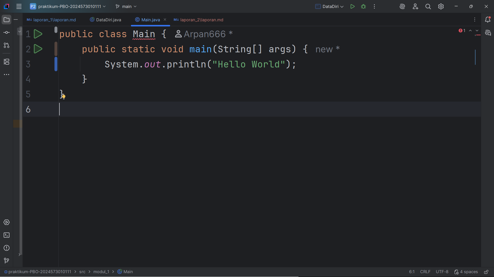
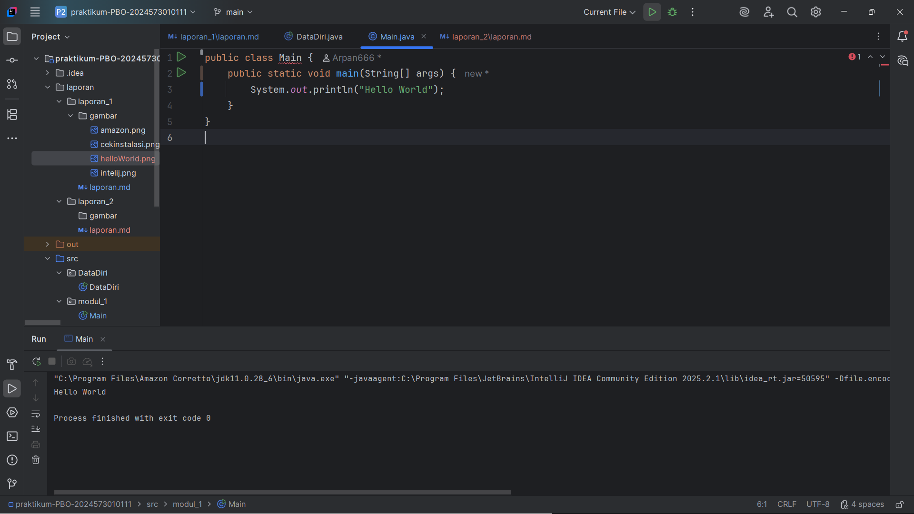

# Laporan Modul 1: Perkenalan Java dan Ekosistemnya
**Mata Kuliah:** Praktikum Pemrograman Berorientasi Objek   
**Nama:** [MIZAUL ARFAN]  
**NIM:** [2024573010111]  
**Kelas:** [TI 2A]

---

## Abstrak
Laporan ini membahas teori dasar Java dan ekosistemnya, termasuk mengapa paradigma Pemrograman Berbasis Objek (OOP) penting,
komponen-komponen seperti JDK, JRE, JVM, dan lingkungan pengembangan (IDE). Selain itu dijelaskan langkah-langkah instalasi Java (menggunakan Amazon Corretto) serta cara pembuatan program sederhana “Hello World” di Java menggunakan IntelliJ IDEA. Tujuan laporan ini adalah mendokumentasikan proses secara jelas agar dapat diikuti oleh siapa pun untuk memulai Java dan membuat program pertama.
---

## 1. Pendahuluan
- 
Teori Lengkap tentang Java dan Ekosistemnya

Pemrograman Berbasis Objek (OOP):
Pemrograman yang mengorganisir kode dalam bentuk objek yang memiliki atribut (properties) dan metode (behaviour). Keuntungan utama OOP meliputi modularitas (kode terbagi dalam unit-unit yang mudah dikelola), reusability (kode dapat dipakai ulang), maintainability (mudah dipelihara), dan scalability (mudah dikembangkan).

Java sebagai pilihan bahasa pemrograman:

Platform independence (“Write once, run anywhere”) – Java yang sudah dikompilasi menjadi bytecode bisa dijalankan di berbagai OS melalui JVM.

Strongly typed language – tipe data dicek secara ketat saat kompilasi, sehingga potensi kesalahan runtime bisa dikurangi.

Rich library – koleksi pustaka yang luas untuk berbagai kebutuhan: manipulasi string, networking, koneksi database, dll.

Komunitas besar – banyak dokumentasi, forum, dan sumber belajar yang aktif.

Standar industri – Java banyak dipakai di banyak perusahaan; penguasaan Java memberikan nilai tambah profesional.

Komponen-komponen dalam ekosistem Java:

Komponen	Fungsi / Kegunaan

JDK (Java Development Kit)	: Toolset lengkap untuk pengembangan: mengompilasi kode, menjalankan, debugging, utilities.

JRE (Java Runtime Environment)  : Lingkungan runtime untuk menjalankan aplikasi Java yang sudah dikompilasi. Tidak termasuk tools development.

JVM (Java Virtual Machine)	: Mesin virtual yang menjalankan bytecode. Mengelola memory, menjalankan instruksi, verifikasi keamanan, serta optimisasi seperti Just-In-Time (JIT).

IDE (Integrated Development Environment) :	Lingkungan terpadu yang membundel editor kode, debugger, project management, dan fitur-lain untuk memudahkan pengembangan. Contoh: IntelliJ IDEA Community Edition.

---

## 2. Proses instalasi Java
- 
Berikut langkah demi langkah instalasi Java (JDK) di Windows berdasarkan modul:

1. Download Amazon Corretto (JDK):

2. Buka browser → navigasi ke situs resmi Amazon Corretto.
Pilih versi JDK yang didukung LTS seperti Corretto 17 atau 21.

3. Pilih installer untuk Windows (biasanya file dengan ekstensi .msi).
Instalasi JDK di Windows:

4. Buka file .msi hasil download. Jika muncul notifikasi keamanan (“User Account Control”), pilih Yes.

5. Pada layar welcome, klik Next. Setujui license agreement.

6. Pada bagian "Custom Setup", biarkan komponen default terpilih. Klik Next → Install.

7. Tunggu sampai instalasi selesai, kemudian klik Finish.
8. Set environment variables di Windows:
Klik kanan “This PC” → Properties → “Advanced system settings”. Klik Environment Variables.
Di bagian System variables, buat variable baru:
Nama variabel: JAVA_HOME

9. Nilai variabel: path ke folder instalasi JDK, misalnya C:\Program Files\Amazon Corretto\jdk17.x.x_xx

10. Kemudian cari variabel Path di System variables, edit → tambahkan %JAVA_HOME%\bin.

11. Restart Command Prompt agar perubahan variabel lingkungan diterapkan.
Verifikasi instalasi:

12. Buka Command Prompt → ketik java -version → tekan Enter. Harus tampil versi Java yang sudah diinstal.

13. Ketik javac -version → cek versi compiler.

---

## 3. Laporan proses pembuatan program hello world dengan java
Berikut langkah-proses membuat program “Hello World” menggunakan Java di IntelliJ IDEA:

1. Membuat proyek baru di IntelliJ IDEA:

2. Buka IntelliJ IDEA Community Edition.

3. Pilih New Project. Pastikan Project SDK sudah di-set ke JDK yang telah diinstal. Jika belum, tambahkan SDK dengan menunjuk ke folder instalasi JDK.

4. Membuat class Java baru:Di dalam direktori src, klik kanan → New → Java Class. Beri nama Main.
5. menulis kode program

6. Menjalankan program:
Klik run pada IntelliJ IDEA → program dijalankan. Hasil yang diharapkan muncul di konsol: Hello World

Di dalam direktori src, klik kanan → New → Java Class. Beri nama Main.
---

## 4. Referensi
Module 1 – Course Introduction & Lab Setup

Amazon Corretto – halaman resmi distribusi OpenJDK oleh Amazon — https://aws.amazon.com/corretto/
IntelliJ IDEA Community Edition – JetBrains — https://www.jetbrains.com/idea/
---
