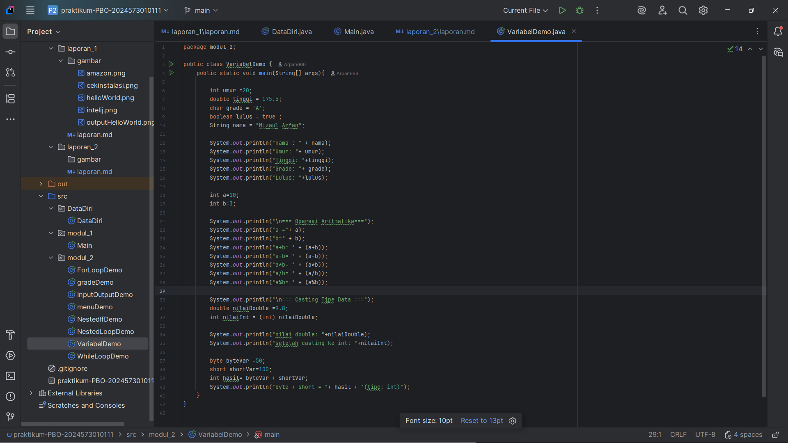
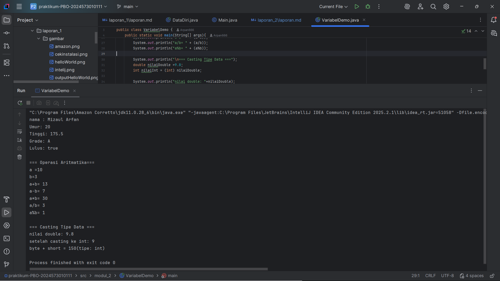
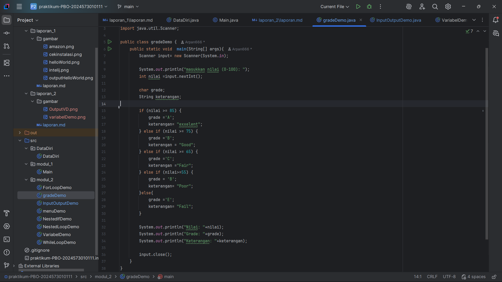
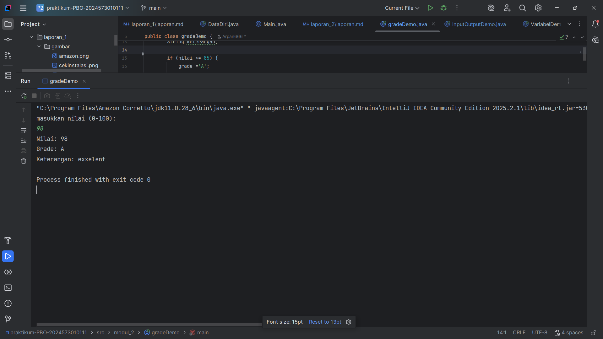

# Laporan Modul 2: Dasar Pemrograman Java
**Mata Kuliah:** Praktikum Pemrograman
Berorientasi Objek   
**Nama:** [MIZAUL ARFAN]  
**NIM:** [2024573010111]  
**Kelas:** [TI 2A]

---

## 1. Abstrak
Laporan ini berisi dasar-dasar pemrograman Java melalui beberapa praktikum: variabel dan tipe data, input-output dengan Scanner, struktur kontrol percabangan, serta perulangan.
Tujuan laporan ini adalah memahami konsep fundamental Java dan cara mengimplementasikan kode sederhana dengan langkah praktis.

---
## 2. Praktikum
### Praktikum 1 - Variabel dan Tipe Data
#### Dasar Teori
Java memiliki tipe data primitif (byte, short, int, long, float, double, boolean, char) dan reference (String, Array, Object).
Variabel harus mengikuti aturan penamaan tertentu (tidak boleh diawali angka, case sensitive, tidak pakai keyword).
#### Langkah Praktikum
1. Membuat package modul_2
2. Membuat file VariabelDemo.java
3. Menuliskan kode untuk mendeklarasikan dan menampilkan berbagai tipe data.

#### Screenshoot Hasil

#### Analisa dan Pembahasan
Variabel memegang data dengan tipe tertentu. Pemilihan tipe memengaruhi penggunaan memori dan operasi yang bisa dilakukan.

### Praktikum 2 - Input, Output dan Scanner
#### Dasar Teori
Class Scanner pada package java.util digunakan membaca input user.
Method seperti nextInt(), nextDouble(), nextLine(), next(), nextBoolean() tersedia.
#### Langkah Praktikum
1. Membuat file InputOutputDemo.java
2. Menulis kode menggunakan Scanner untuk membaca dan menampilkan input user.

#### Screenshoot Hasil

#### Analisa dan Pembahasan

### Praktikum 3 - Struktur Kontrol: Percabangan
#### Dasar Teori
Percabangan digunakan untuk keputusan: if, if-else, if-else if-else, dan switch.
#### Langkah Praktikum
1. Membuat GradeDemo.java untuk menentukan nilai huruf.

2. Membuat MenuDemo.java untuk menu berbasis switch.

3. Membuat NestedIfDemo.java untuk kategori usia.

#### Screenshoot Hasil

#### Analisa dan Pembahasan
Percabangan memungkinkan program mengambil jalur eksekusi berbeda sesuai kondisi,
mendukung fleksibilitas logika program.

### Praktikum 4 - Struktur Kontrol: Perulangan
#### Dasar Teori
Perulangan mengulang eksekusi: for, while, dan do-while.
#### Langkah Praktikum
1. Membuat ForLoopDemo.java untuk menampilkan angka dengan for.

2. Membuat WhileLoopDemo.java untuk contoh while dan do-while.

3. Membuat NestedLoopDemo.java untuk loop bersarang.

#### Screenshoot Hasil

#### Analisa dan Pembahasan
Looping menghemat kode untuk tugas berulang. for cocok untuk iterasi dengan batas jelas,
sedangkan while/do-while untuk kondisi dinamis.

---

## 3. Kesimpulan
Melalui praktikum ini dipahami dasar Java berupa variabel, tipe data, input-output, percabangan, dan perulangan.
Konsep tersebut menjadi pondasi logika program yang lebih kompleks.

---

## 5. Referensi
Modul 2 – Dasar Pemrograman Java (HackMD) — https://hackmd.io/@mohdrzu/B1DuPNNOgx
Dokumentasi Oracle Java: Language Basics — https://docs.oracle.com/javase/tutorial/java/nutsandbolts/

---
